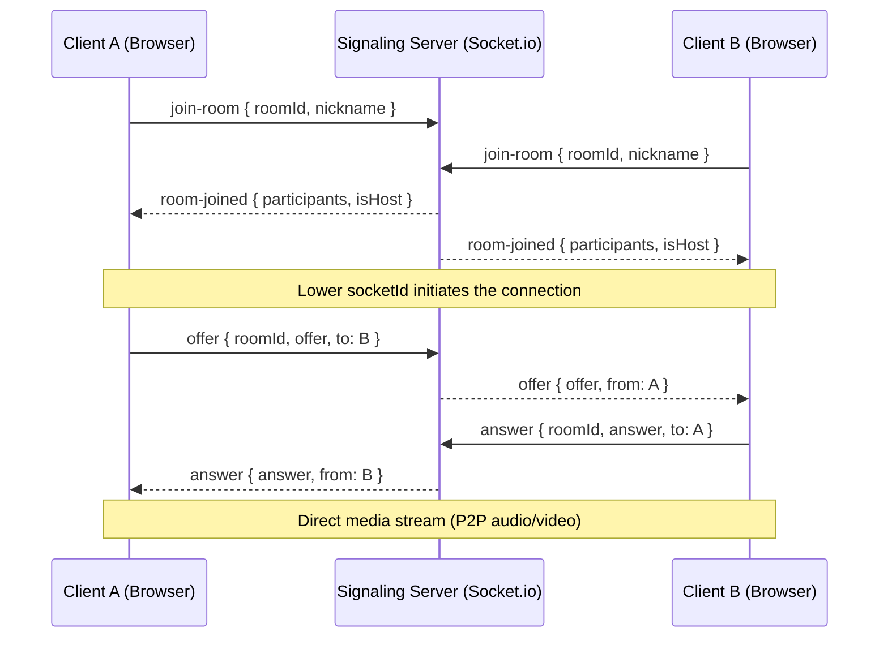
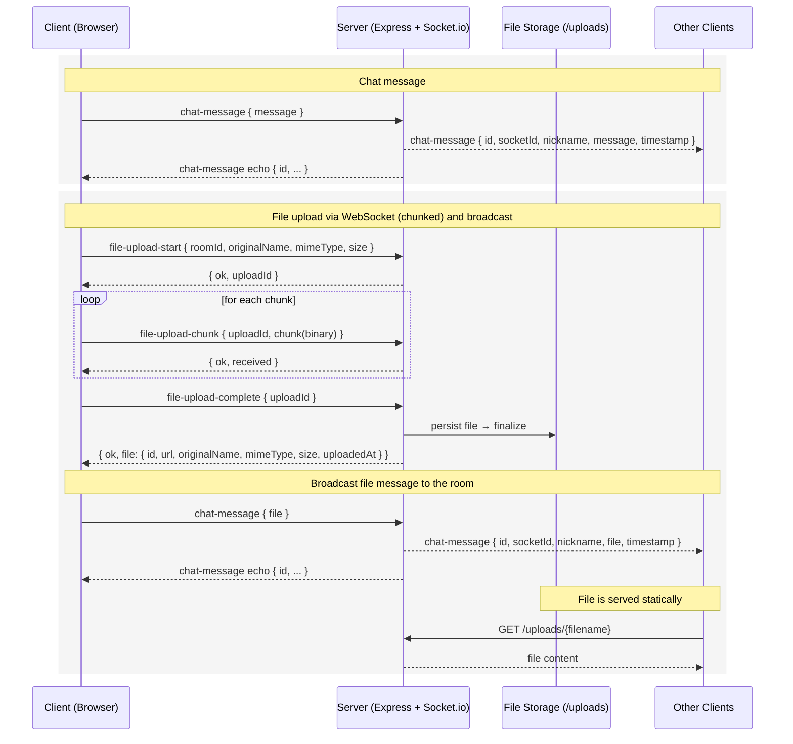

# WebRTC and Chat/File Upload — Glossary and Flows

## Glossary: Core techniques used

| Term | Description |
| --- | --- |
| WebRTC | Browser-to-browser real-time media transport (audio/video/data). After handshake, media flows P2P (server not in media path). |
| Signaling | Out-of-band channel to exchange metadata (SDP offers/answers, ICE). Here implemented over WebSocket (Socket.io). |
| SDP (Session Description Protocol) | Text description of media capabilities, codecs, encryption, and transport parameters. |
| Offer | Initiator’s SDP proposing connection parameters (codecs, tracks, transport). Sent to peer. |
| Answer | Responder’s SDP matching the offer with compatible parameters. Sent back to initiator. |
| ICE (Interactive Connectivity Establishment) | Discovers workable network paths between peers through NATs/firewalls. |
| ICE candidate | A single possible route (IP, port, protocol, priority) discovered by ICE. |

### WebSocket terms used in this project

| Term | Description |
| --- | --- |
| WebSocket | Persistent two-way connection between browser and server. |
| Event | Named message sent/received over the socket (e.g., `join-room`, `chat-message`). |
| emit | Send an event from client or server. Can include an ack callback. |
| broadcast | Send an event to many clients at once (e.g., everyone in a room with `io.to(roomId).emit(...)`). |

---

## 1) WebRTC Signaling (2 peers via signaling server)

### How this flow works in the app

1. **Join room**: Both browsers connect to the Socket.io server and emit `join-room`. The server replies with current participants and host info.
2. **Choose initiator**: The client with the lower `socketId` acts as initiator to avoid glare (both offering at once).
3. **Offer/Answer exchange**: The initiator creates an SDP offer and sends it to the responder via the signaling server. The responder generates an SDP answer and sends it back.
4. **P2P connection**: After the offer/answer exchange, the browsers establish a direct peer-to-peer connection and stream media directly.

---

## 2) Chat and File Upload (room-scoped)

### How this flow works in the app

- **Chat**: The client emits `chat-message` over WebSocket. The server creates a message object, stores it in memory (`room.messages`), and broadcasts it to everyone in the room.
- **File upload (WebSocket, chunked)**:
  - Client emits `file-upload-start { roomId, originalName, mimeType, size }` → server returns `{ ok, uploadId }`.
  - Client reads the file and sends multiple `file-upload-chunk { uploadId, chunk }` events (binary chunks). Server acks each with `{ ok, received }` and streams to disk.
  - Client emits `file-upload-complete { uploadId }`. Server finalizes the file, returns `{ ok, file }` with metadata `{ id, url, originalName, mimeType, size, uploadedAt }`.
  - Client then emits `chat-message { file }` so all participants receive the file message.

---

## What uses WebRTC vs WebSocket

- **WebRTC**: The actual audio/video streams between browsers after handshake (implemented in `client/src/hooks/useWebRTC.ts` and rendered by `VideoGrid`/`VideoTile`).
- **WebSocket (Socket.io)**: Signaling (`join-room`, `offer`, `answer`), app events (`chat-message`, `user-mute-changed`), and file uploads (`file-upload-start`, `file-upload-chunk`, `file-upload-complete`).
